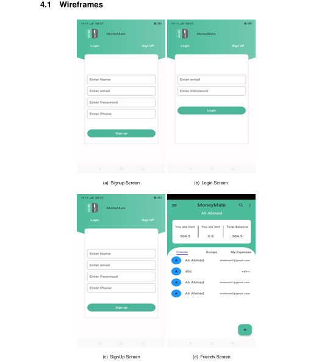

## money-mate
Keep track of expenses between friends, family etc. I have made this project during the Software Engineering Lab.

## Installation
Refer [Documentation](./assets/se-lab-project-report.pdf)

## Contributing
Contributions are welcome! To contribute:
- Fork the repository.
- Make your changes.
- Commit and push.
- Create a pull request.

## How It Looks?

## License
This project is licensed under the [MIT License](LICENSE).